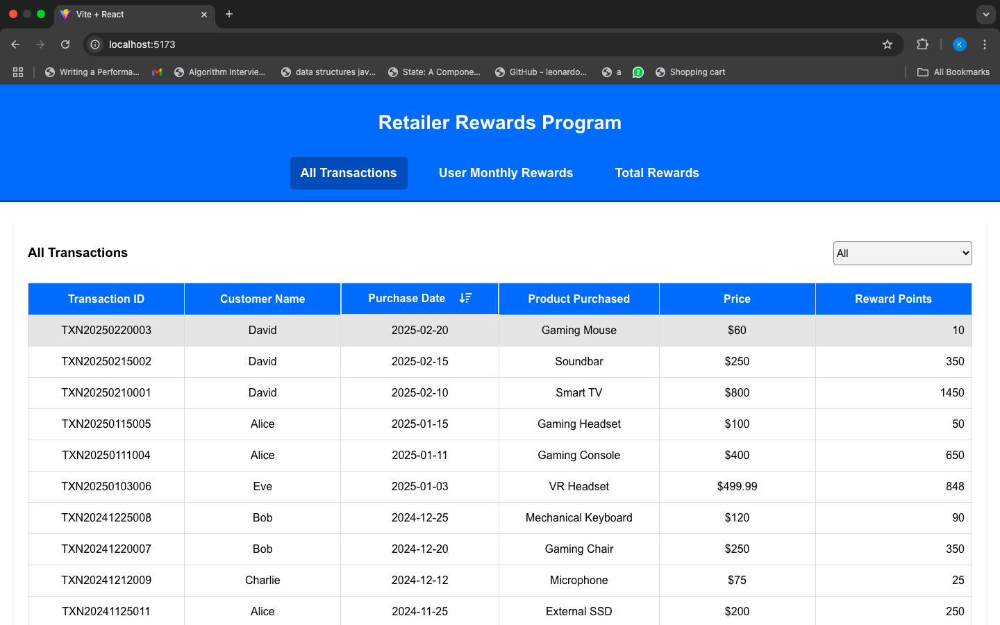
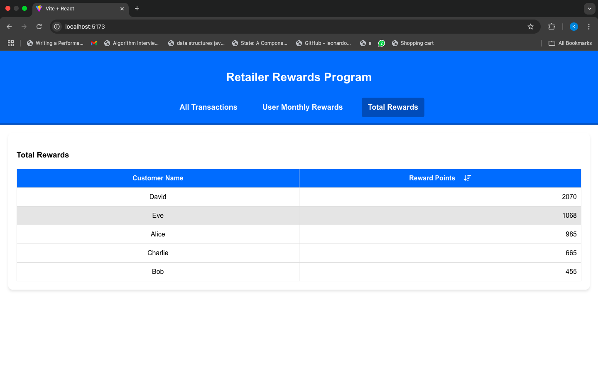

# React + Vite

## Overview:

The Retailer Rewards Program is a web application that tracks customer transactions and calculates reward points based on purchase amounts. Users can view transactions, monthly rewards, and total rewards for each customer.

## Features:

- View customer transactions with sorting and filtering options.
- Calculate reward points dynamically based on transaction amounts.
- View monthly reward points for each customer.
- View total reward points earned by customers.
- Responsive UI with a clean table layout.
- Optimized API calls using React Hooks.

## Tech Stack:

- Frontend: React, React Hooks, React Testing Library (RTL), Vitest
- State Management: React useState, useEffect
- Styling: CSS Modules
- Testing: Vitest, React Testing Library
- API Handling: Custom React Hooks

## Installation & Setup:

## 1️ Clone the repository

git clone https://github.com/KomalLalchandani/CustomerRewards.git
cd CustomerRewards

## 2️ Install dependencies

npm install
OR
yarn install

## 3️ Run the application

npm run dev
OR
yarn dev

## Project Structure

src
┣ components
┃ ┣ common
┃ ┃ ┗ Header.js
┃ ┣ scene
┃ ┃ ┣ CustomerRewards.js
┃ ┣ sceneComponents
┃ ┃ ┣ Transactions.js
┃ ┃ ┣ MonthlyRewards.js
┃ ┃ ┗ TotalRewards.js
┣ hooks
┃ ┗ useGetTransactionListHook.js
┣ services
┃ ┗ api.js
┣ utils
┃ ┗ index.js
┣ App.js
┣ index.js
┣ styles.css

## Testing:

To run the test cases, use the following command:

npm test
OR
yarn test

## ✅ Successful Cases

### Transactions List Display

### Total Reward Points Calculation

## ❌ Error Cases

### API Failure

## License

This project is licensed under the MIT License.

## Author

Komal Lalchandani
Contact: lalchandanikomal@gmail.com
GitHub: KomalLalchandani
